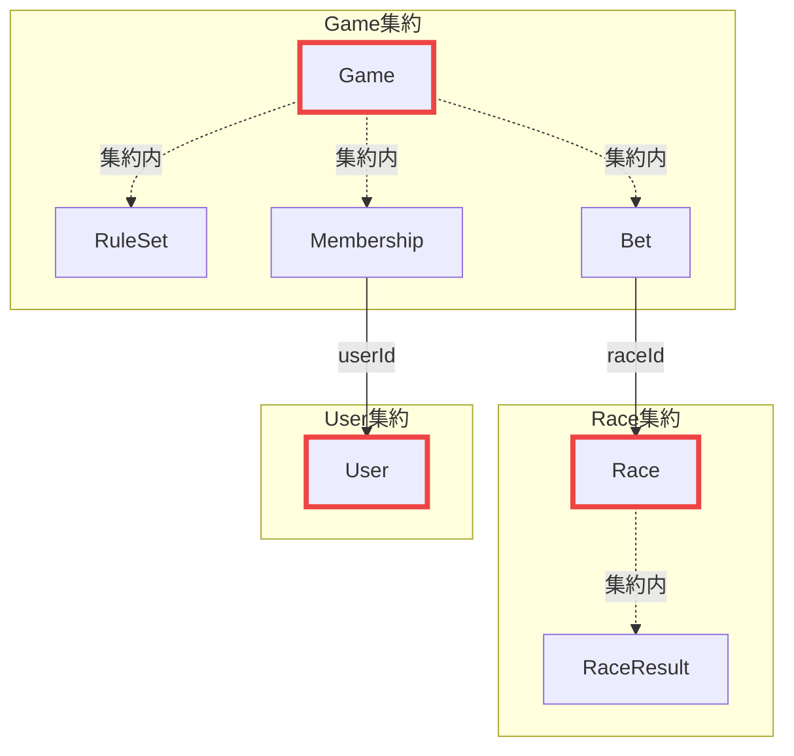

```mermaid
graph TB
  %% ===== 集約 =====


  subgraph A2["Game集約"]
    Game:::root
    RuleSet
    Membership
    Bet
    %% 集約内の包含（同一トランザクション境界）
    Game -.->|集約内| RuleSet
    Game -.->|集約内| Membership
    Game -.->|集約内| Bet
  end

  subgraph A3["Race集約"]
    Race:::root
    RaceResult
    %% 集約内の包含（同一トランザクション境界）
    Race -.->|集約内| RaceResult
  end

  subgraph A1["User集約"]
    User:::root
  end

  %% ===== 集約間参照（子→親のみ & 最小化） =====
  %% MembershipはUserを外部参照（承認制の主体）
  Membership -->|userId| User

  %% BetはRaceを外部参照（raceId）
  Bet -->|raceId| Race

  %% ===== スタイル =====
  classDef root stroke:#ef4444,stroke-width:4px
```
