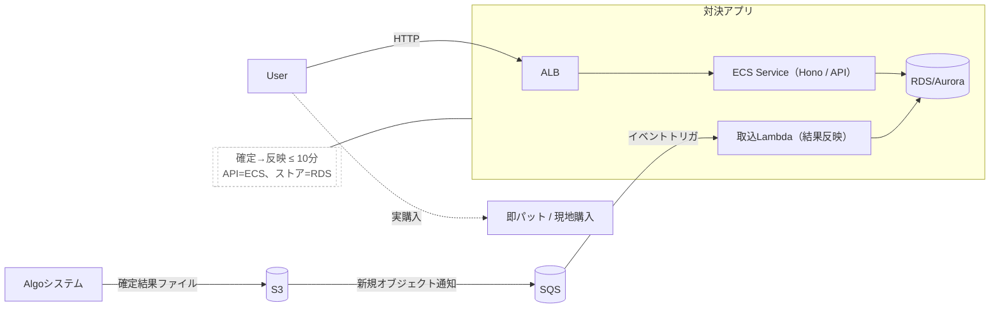

```mermaid
flowchart LR
  %% ===== 外部 =====
  user[User]
  pat[即パット / 現地購入]
  algo[Algoシステム]
  s3[(S3)]
  sqs[(SQS)]

  %% ===== 対決アプリ =====
  subgraph duelApp[対決アプリ]
    direction TB
    alb[ALB]
    ecsApi[ECS Service（Hono / API）]
    ingestLambda[取込Lambda（結果反映）]
    rds[(RDS/Aurora)]

    alb --> ecsApi --> rds
    ingestLambda --> rds
  end

  %% ユーザ操作
  user -->|HTTP| alb
  user -. 実購入 .-> pat

  %% 結果供給ライン
  algo -- 確定結果ファイル --> s3
  s3 -- 新規オブジェクト通知 --> sqs
  sqs -->|イベントトリガ| ingestLambda

  %% ノート
  classDef note fill:#fff,stroke:#bbb,color:#555,stroke-dasharray:3 3
  note_slo[[確定→反映 ≤ 10分<br/>API=ECS、ストア=RDS]]:::note
  note_slo --- duelApp
```
