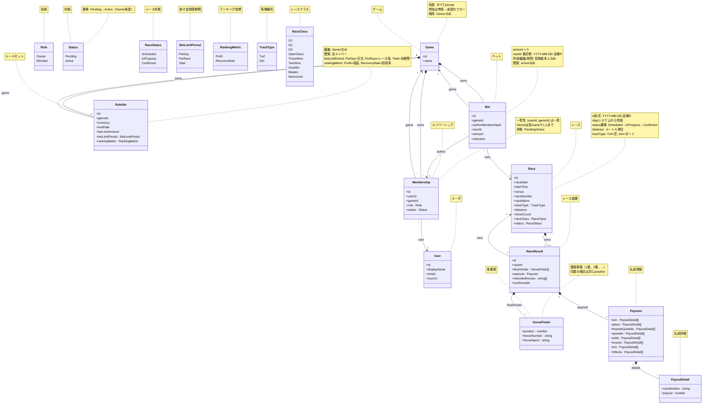

```mermaid
classDiagram
  %% ==== Core Domain Objects (MVP: 承認制, Aggregate Root = Game) ====
  class User {
    +id
    +displayName
    +email
    +iconUri
  }
  class Game {
    +id
    +name
  }
  class Membership {
    +id
    +userId
    +gameId
    +role : Role
    +status : Status
  }
  class RuleSet {
    +id
    +gameId
    +currency
    +endDate
    +betLimitAmount
    +betLimitPeriod : BetLimitPeriod
    +rankingMetric : RankingMetric
  }
  class Bet {
    +id
    +gameId
    +authorMembershipId
    +raceId
    +amount
    +selection
  }
  %% ==== Race Domain (追加) ====
  class Race {
    +id
    +raceDate
    +startTime
    +venue
    +raceNumber
    +raceName
    +trackType : TrackType
    +distance
    +horseCount
    +raceClass : RaceClass
    +status : RaceStatus
  }
  class RaceResult {
    +id
    +raceId
    +finishOrder : HorseFinish[]
    +payouts : Payouts
    +refundedHorses : string[]
    +confirmedAt
  }
  class HorseFinish {
    +position : number
    +horseNumber : string
    +horseName : string
  }
  class Payouts {
    +win : PayoutDetail[]
    +place : PayoutDetail[]
    +bracketQuinella : PayoutDetail[]
    +quinella : PayoutDetail[]
    +wide : PayoutDetail[]
    +exacta : PayoutDetail[]
    +trio : PayoutDetail[]
    +trifecta : PayoutDetail[]
  }
  class PayoutDetail {
    +combination : string
    +payout : number
  }
  %% ==== Enumerations (最小) ====
  class Role {
    Owner
    Member
  }
  class Status {
    Pending
    Active
  }
  class RaceStatus {
    Scheduled
    InProgress
    Confirmed
  }
  class BetLimitPeriod {
    PerDay
    PerRace
    Total
  }
  class RankingMetric {
    Profit
    RecoveryRate
  }
  class TrackType {
    Turf
    Dirt
  }
  class RaceClass {
    G1
    G2
    G3
    OpenClass
    ThreeWins
    TwoWins
    OneWin
    Maiden
    Newcomer
  }
  %% ==== 関連（子→親の参照） ====
  Membership "*" --> "1" User   : user
  Membership "*" --> "1" Game   : game
  Bet       "*" --> "1" Game        : game
  Bet       "*" --> "1" Membership  : author
  Bet       "*" --> "1" Race        : race
  RuleSet   "*" --> "1" Game   : game
  RaceResult "1" --> "1" Race  : race
  RaceResult "1" *-- "*" HorseFinish : finishOrder
  RaceResult "1" *-- "1" Payouts : payouts
  Payouts "1" *-- "*" PayoutDetail : details
  %% ==== 集約（親が子を所有：Aggregate = Game） ====
  Game "1" *-- "1" RuleSet     : owns
  Game "1" *-- "*" Membership  : owns
  Game "1" *-- "*" Bet         : owns
  %% ==== Race集約（独立） ====
  Race "1" *-- "0..1" RaceResult : owns
  %% ==== ドメインルール / 制約 ====
  note for Game "前提: すべてprivate<br/>参加は申請→承認のフロー<br/>削除: Ownerのみ"
  note for Membership "一意性: (userId, gameId) は一意<br/>Ownerは各Gameで1人まで<br/>状態: Pending/Active"
  note for Status "遷移: Pending→Active（Owner承認）<br/>"
  note for Bet "amount > 0<br/>raceId 書式例: YYYY-MM-DD-会場R<br/>作成/編集/削除: 投稿者本人のみ<br/>閲覧: Activeのみ"
  note for RuleSet "編集: Ownerのみ<br/>閲覧: 全メンバー<br/>betLimitPeriod: PerDay=日次, PerRace=レース毎, Total=全期間<br/>rankingMetric: Profit=収益, RecoveryRate=回収率"
  note for Race "id形式: YYYY-MM-DD-会場R<br/>Algoシステムから供給<br/>status遷移: Scheduled→InProgress→Confirmed<br/>distance: メートル単位<br/>trackType: Turf=芝, Dirt=ダート"
  note for HorseFinish "着順情報（1着、2着、...）<br/>同着の場合は同じposition"
  %% ==== 日英対訳（Glossary） ====
  note for User       "ユーザ"
  note for Game       "ゲーム"
  note for Membership "メンバーシップ"
  note for RuleSet    "ルールセット"
  note for Bet        "ベット"
  note for Role       "役割"
  note for Status     "状態"
  note for Race       "レース"
  note for RaceResult "レース結果"
  note for HorseFinish "馬着順"
  note for Payouts    "払戻情報"
  note for PayoutDetail "払戻詳細"
  note for RaceStatus "レース状態"
  note for BetLimitPeriod "掛け金制限期間"
  note for RankingMetric "ランキング指標"
  note for TrackType "馬場種別"
  note for RaceClass "レースクラス"
```
