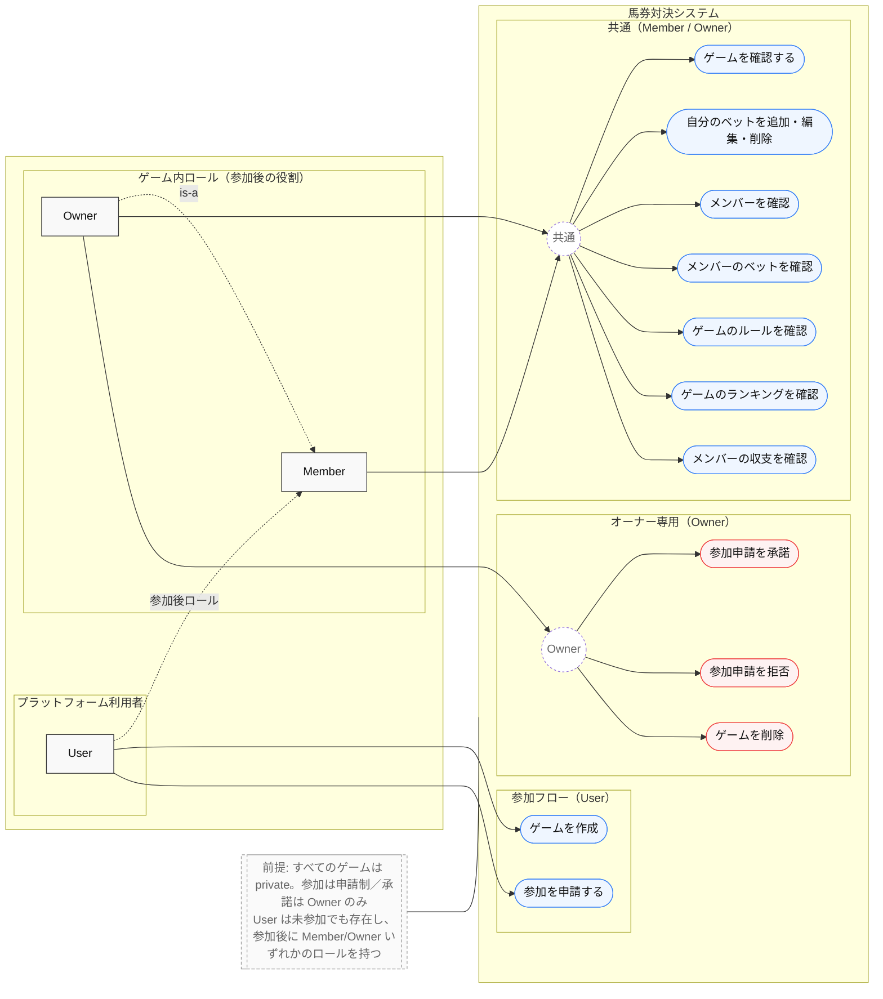

```mermaid
flowchart LR
  %% スタイル
  classDef actor stroke:#333,stroke-width:1,fill:#f9f9f9,color:#111;
  classDef ucCommon stroke:#3b82f6,fill:#eff6ff,color:#111;
  classDef ucOwner  stroke:#ef4444,fill:#fef2f2,color:#111;
  classDef hub      stroke-dasharray:3 3,fill:#fff,color:#666;
  classDef note     stroke:#999,stroke-dasharray:4 3,fill:#fafafa,color:#666;

  %% 役割
  subgraph Actors[ ]
    direction LR

    %% 左: プラットフォーム利用者
    subgraph A_User[プラットフォーム利用者]
      direction TB
      user[User]:::actor
    end

    %% 右: ゲーム内ロール
    subgraph A_Role[ゲーム内ロール（参加後の役割）]
      direction TB
      member[Member]:::actor
      owner[Owner]:::actor
      owner -. is-a .-> member
    end
  end

  %% 参加関係（視覚補助）
  user -. 参加後ロール .-> member

  %% システム
  subgraph System[馬券対決システム]
    direction LR

    %% 共通（Member / Owner）
    subgraph laneC[共通（Member / Owner）]
      direction TB
      hubC((共通)):::hub
      uc_check_game([ゲームを確認する]):::ucCommon
      uc_my_bets_crud([自分のベットを追加・編集・削除]):::ucCommon
      uc_members_view([メンバーを確認]):::ucCommon
      uc_bets_view([メンバーのベットを確認]):::ucCommon
      uc_rules_view([ゲームのルールを確認]):::ucCommon
      %% 追加分
      uc_leaderboard_view([ゲームのランキングを確認]):::ucCommon
      uc_member_profit_view([メンバーの収支を確認]):::ucCommon

      hubC --> uc_check_game & uc_my_bets_crud
      hubC --> uc_members_view & uc_bets_view & uc_rules_view
      hubC --> uc_leaderboard_view & uc_member_profit_view
    end

    %% 参加フロー（User発）
    subgraph laneJ[参加フロー（User）]
      direction TB
      uc_create_game([ゲームを作成]):::ucCommon
      uc_join_request([参加を申請する]):::ucCommon
    end

    %% オーナー専用
    subgraph laneO[オーナー専用（Owner）]
      direction TB
      hubO((Owner)):::hub
      uc_join_approve([参加申請を承諾]):::ucOwner
      uc_join_reject([参加申請を拒否]):::ucOwner
      uc_game_delete([ゲームを削除]):::ucOwner
      hubO --> uc_join_approve & uc_join_reject & uc_game_delete
    end
  end

  %% アクター → ユースケース
  user --> uc_create_game
  user --> uc_join_request

  member --> hubC
  owner --> hubC
  owner --> hubO

  %% 前提ノート
  note_private[[前提: すべてのゲームは private。参加は申請制／承諾は Owner のみ<br/>User は未参加でも存在し、参加後に Member/Owner いずれかのロールを持つ]]:::note
  note_private --- System
```
